# Readme

## 数据收集框架APP

该应用主要是提供一个数据收集方面的应用APP框架，可基于原始代码进行二次开发

## 内容与模块

用户注册模块

用户登录模块

用户校验模块

百度SDK定位模块

天气查询模块

拍照录像模块

动态权限申请模块

网络通信模块

数据填写与传输模块

手机传感器信息采集模块

用户设置模块

底部导航栏栏功能

后台接收模块（不在该仓库，在另外的仓库）

## 特点

专门针对于数据采集而开发

框架式应用，二次开发简单

基础功能均以全部实现

配有后台接收与数据管理web端

## 具体流程

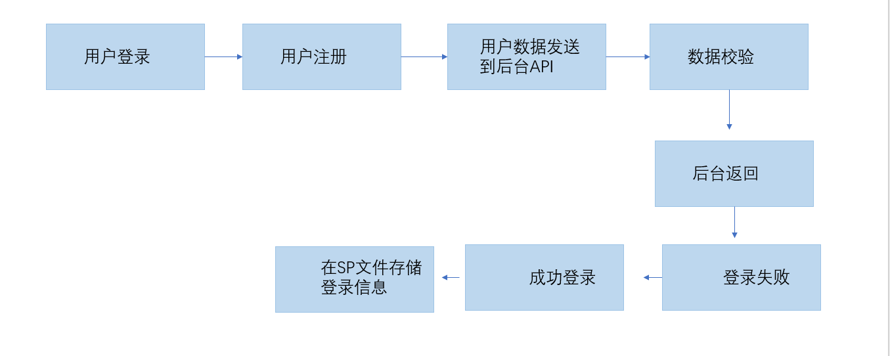

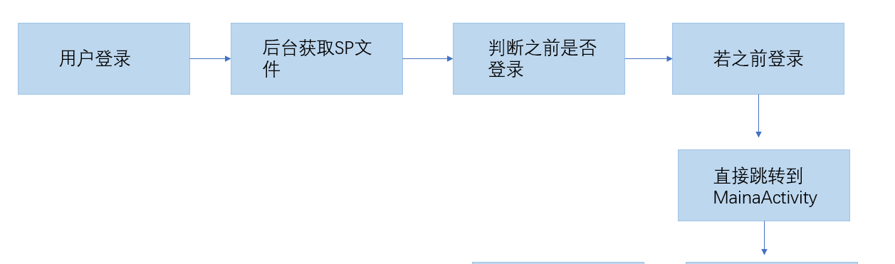

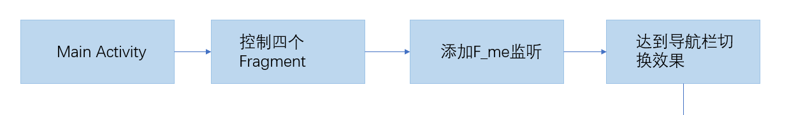

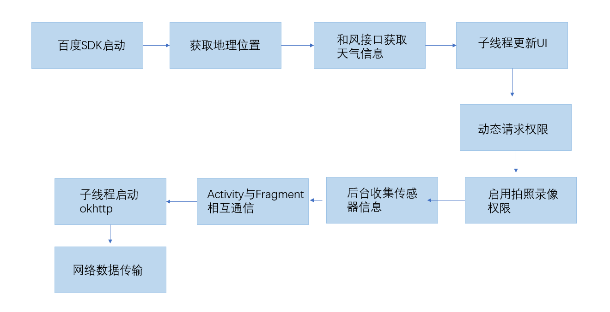

## APP效果展示

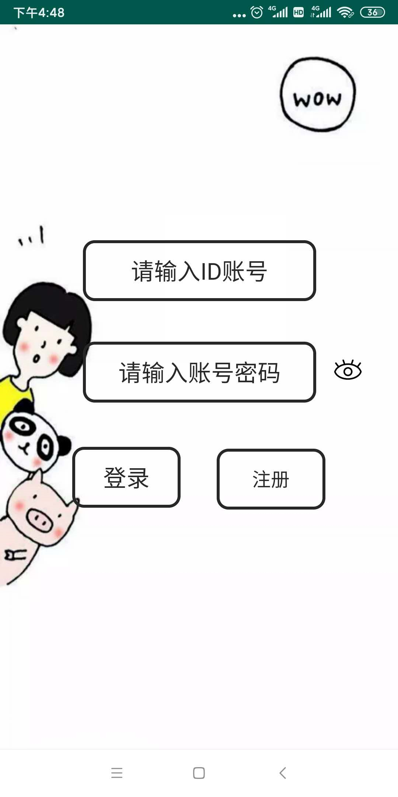

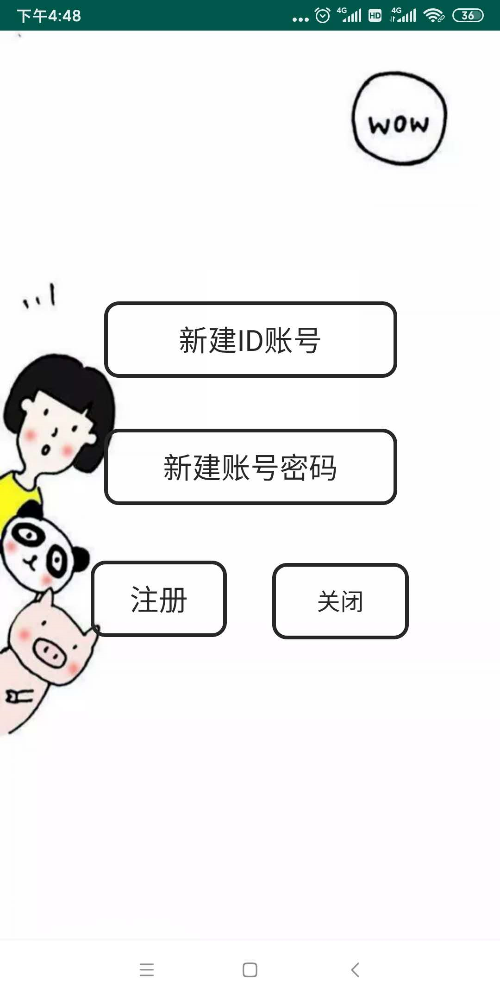

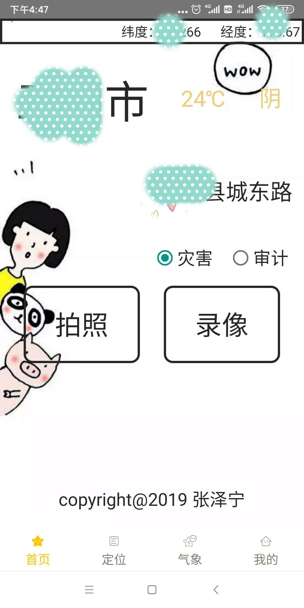

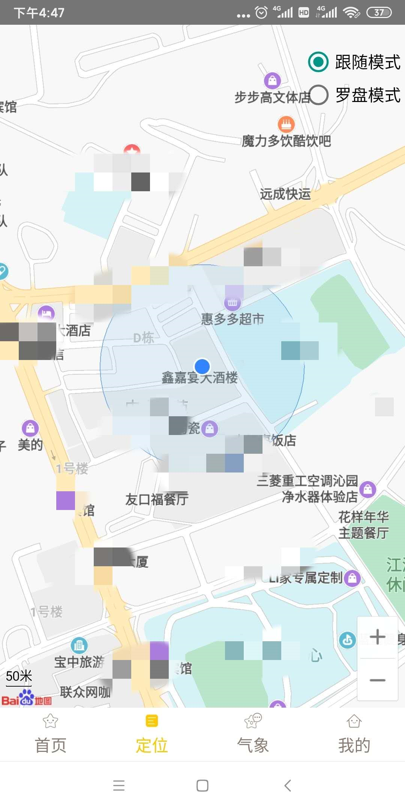

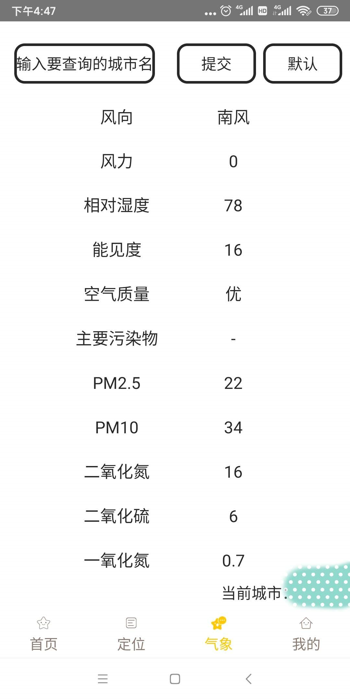

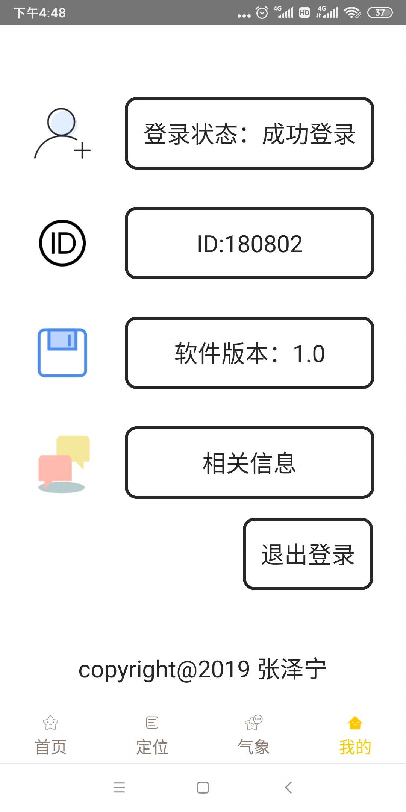

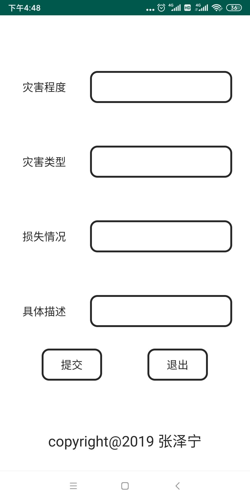